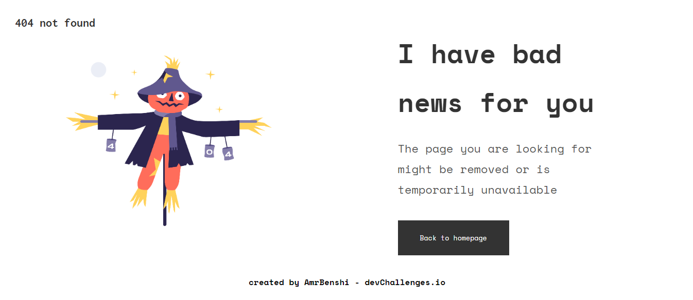

<h1 align="center">404 Not Found Page</h1>

   Solution for a challenge from  <a href="http://devchallenges.io" target="_blank">Devchallenges.io</a>.

  <h3>
    <a href="https://amrbenshi.github.io/404-not-found-master/">
      Demo
    </a>
     | 
    <a href="https://devchallenges.io/solutions/gZVEaJBqCVEoNIOnNMqv">
      Solution
    </a>
     | 
    <a href="https://devchallenges.io/challenges/wBunSb7FPrIepJZAg0sY">
      Challenge
    </a>
  </h3>

<!-- TABLE OF CONTENTS -->

## Table of Contents

- [Overview](#overview)
  - [Built With](#built-with)
- [Features](#features)
- [Contact](#contact)
- [Acknowledgements](#acknowledgements)

<!-- OVERVIEW -->

## Overview

- Where can I see your demo ?
- in my github profile in 404-not-found-master repo
- What have you learned/improved ?
- flex box and font sizes

### Built With

- [HTML]
- [CSS]

## Features

<!-- List the features of your application or follow the template. Don't share the figma file here :) -->

This application/site was created as a submission to a [DevChallenges](https://devchallenges.io/challenges) challenge. The [challenge](https://devchallenges.io/challenges/wBunSb7FPrIepJZAg0sY) was to build an application to complete the given user stories.

## Contact

- GitHub [@AmrBenshi](https://github.com/AmrBenshi)
